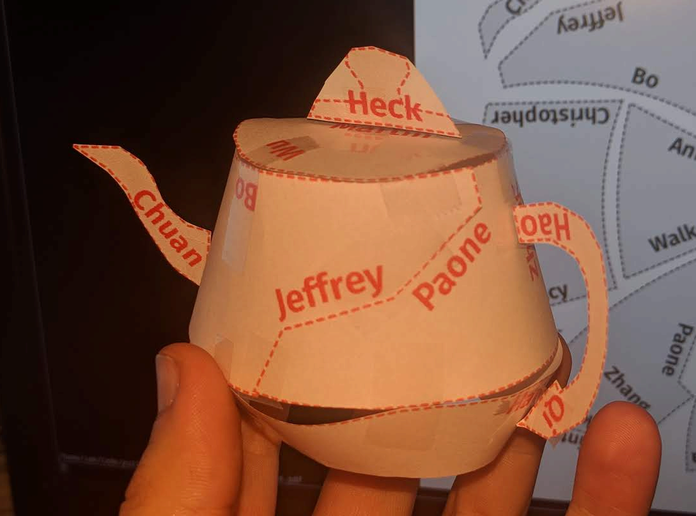

CS@Mines Puzzle Challenge: Fall 2018 Answers
============================================

.. note::

   This document contains the *ANSWERS*. **Stop reading if you wish to solve
   yourself.**

.. raw:: latex

   \clearpage

Time For What
-------------

Print, cut out the pieces, and tape last names together. There's a few names in
there designed to throw you off. This is the result:

So the answer is "tea time", "tea", or similar.

Clock Tower
-----------

There are 13 possible solutions::

   UUUUUDUUDUUDDDDDDDDDDDD
   UUUUUDUUDUDUDDDDDDDDDDD
   UUUUUDUUDDUUDDDDDUDDDDD
   UUUUUDUUDDUDUDDDDDDDDDD
   UUUUUDUUDDUDDDDDDDUDDDD
   UUUUUDUUDDDUUDDDDDDDDDD
   UUUUUDUUDDDUDDDDDDUDDDD
   UUUUUDUUDDDDDUDDDDDDDDD
   UUUUUDUUDDDDDDDUDUDDDDD
   UUUUUDUUDDDDDDDDUDDDDDD
   UUUUDUDUUUDDDDDDDUDDDDD
   UUUUDDUUUUUDDDDDDDDDDDD
   UDUUDUUDUUUDDDDDDDDDDDD

What Time for the Movies
------------------------

Alphabetize the professors, then remove those who are teaching during the time
they were told for the movie. Take the letter from the movie title
corresponding to the hour of the day they were told. The result is::

   WARGAMES

Spin Like a Clock
-----------------

As hinted, the rotor spins by one (clockwise!) with each translation. One needs
to find the "key", which is the starting position of the rotor. There are quite
a few strategies, including trying to decypher some of the smaller words and
counting backwards, or just trying all 26 possibilities. The key in this puzzle
is: ``E`` on inner rotor connects to ``A``.

This leads to the following message::

   THERE MAY BE AN ANSWER
   JUST FOR YOU
   BUT YOULL NEED A TRAIL
   ON AN APPLE TWO

   BE A BANKER FROM BOSTON
   AND NAME YOUR FAMILY
   GET AN EARLY START
   IN MARCH AS ALWAYS

   AT THE BIG BLUE RIVER CROSSING
   ASK FOR A LADY BY THE NAME
   OF MARNIE STEWART

   WHAT DOES SHE WANT

To answer this, the solver must download a copy of the Oregon Trail, play on an
Apple II emulator, or play online (or if they have a real Apple II, great!).

Asking at the Blue River Crossing (they may have to ask multiple times) will
lead to the conversation with Marne Stewart. Marnie says she wants a town, so
the answer is "a town".

Time Travel Tour
----------------

The secret to this puzzle lies in the encoding used to enter the
destinations on the keypad. This was hinted at greatly in the footnote.

The encoding is the 2-letter building codes (BB, GC, etc.). Using the
Mines campus map, the destinations shown on the puzzle can be translated
to this sequence of building codes:

 GH :math:`\to` EH :math:`\to` CO :math:`\to` HH :math:`\to` WA

Entering this on a telephone keypad would produce this sequence of
digits::

   4434264492

Conveniently, this is also a valid US telephone number. Calling this
number plays the song "Time" by Izabo. So the answer is "Izabo".
